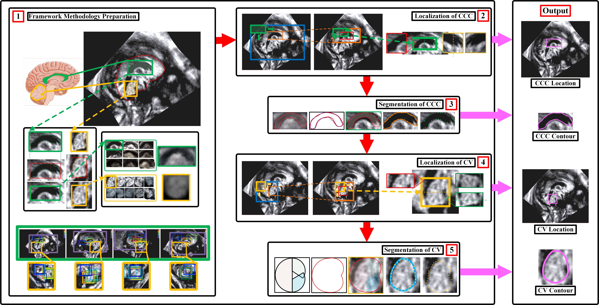

# Automatic Localization and Quantitative Segmentation of CCSP & CV in Fetal Brain Ultrasound

This repository presents the research outcomes from:

> **"A method framework of automatic localization and quantitative segmentation for the cavum septum pellucidum complex and the cerebellar vermis in fetal brain ultrasound images"**  
> *Qifeng Wang et al., Quantitative Imaging in Medicine and Surgery (QIMS), 2023*  
> DOI: [10.21037/qims-22-1242](https://dx.doi.org/10.21037/qims-22-1242)

---

## Overview

Our framework addresses the challenge of **automated localization and segmentation** of the:
- **Corpus Callosum–Cavum Septum Pellucidum Complex (CCSP)**  
- **Cerebellar Vermis (CV)**  

in **fetal brain mid-sagittal ultrasound images (FBMUIs)**, enabling efficient prenatal CNS anomaly detection.



---

## Highlights
- **5-step automated pipeline**:  
  1. Average Template Generation (VAE)  
  2. CCSP Localization  
  3. CCSP Contour Segmentation  
  4. CV Localization (guided by CCSP)  
  5. CV Contour Segmentation  

- **Dataset**: 140 FBMUIs (20–28 weeks GA), annotated by five senior sonographers.  
- **Validated clinically** at Shengjing Hospital, China Medical University.

---

## Demonstrations

### Method and Results Video


- Full process: **Localization → Contour Segmentation → Quantification**  
- Includes **comparison with active contour baselines** (SNAKE, DRLSE, Chan-Vese, etc.)

---

## Citation

If you find our work useful in your research, please consider citing:

```bibtex
@article{wang2023ccpcvsegmentation,
  title={A method framework of automatic localization and quantitative segmentation for the cavum septum pellucidum complex and the cerebellar vermis in fetal brain ultrasound images},
  author={Wang, Qifeng and Pei, Jingjing and Ouyang, Jian and Chen, Yu and Pu, Jingyu and Humayun, Awais and Zhao, Dongdong and Liu, Bin},
  journal={Quantitative Imaging in Medicine and Surgery},
  volume={13},
  number={9},
  pages={6059--6088},
  year={2023},
  doi={10.21037/qims-22-1242}
}
```

---

## Contact
For **data requests, academic collaborations, or presentation materials**:  
- **Email**: [wqf970702@mail.dlut.edu.cn](mailto:wqf970702@mail.dlut.edu.cn)  
- **ResearchGate**: [Qifeng Wang](https://www.researchgate.net/profile/Qifeng-Wang-9?ev=hdr_xprf)
